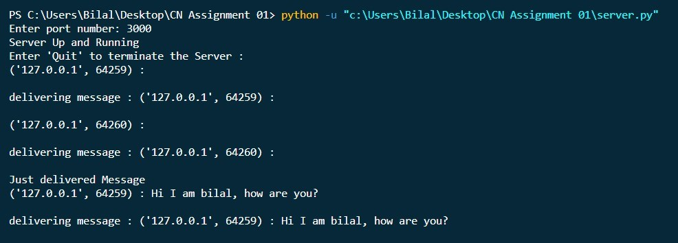

# Chat Application using socket programming and Python

## Description
This project uses concepts of socket programming to create a simple chat application using python programming language.
## Guidelines to use
1. Run `server.py` script.
   
2. Enter the port number.
3. Run `client.py` script to create multiple clients (but you must enter the same port number which you entered in the `server.py` script).
4. Below is Client 01.
    
5. And here is Client 02.
    
6. In the screenshots you can see both clients having conversation with each other.
7. You can also create more than 2 clients and simulate a scenario like a group chat.
   